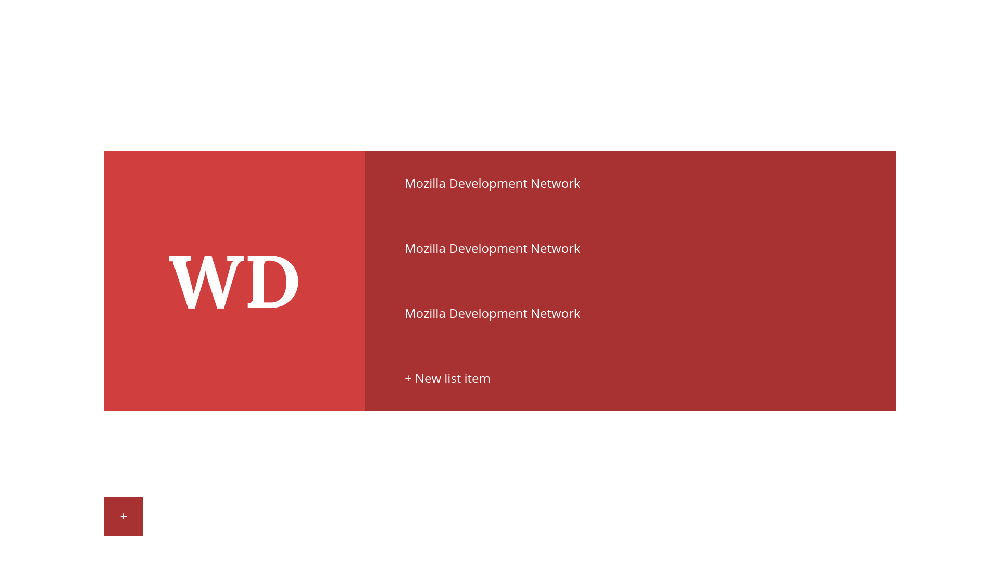

# Start Page Tutorial

## 1 Tooling up

### 1.1 Text Editors

To start with you're going to need a text editor. You can techinically use anything on your PC that will allow you save text, such as Notepad however I recommend that you install a proper one.

___Note:__ Before you get ahead of yourself thinking that it would be worth using Notepad just because it's shit. Don't. Nobody cares. All it signals is that you're a hipster or you like unnecessary pain._

Text editors that I have used and do recommend are:
* Sublime Text 3 (Sublime)
* Atom
* Visual Studio Code (VS Code)

A couple of other popular ones are:
* Notepad++
* Brackets

_Note:_ One nice feature of Brackets is that it has a 'live preview' feature, meaning that it will auto-refresh your browser when you save the file. Last time I tried using it however, the live preview kept breaking. Your mileage may vary.

The reason I recommend that you install a proper text editor such as one of these is for two main reasons:
1. They allow you to install extensions. These extensions have a wide range of uses such as:
	* Checking for errors in your code
	* Allowing you to convert colours between formats such as hexadecimal (#ffffff) to rgb (255, 255, 255)
	* Auto-completing code
2. They use syntax highlighting to highlight different types of code. For example, a HTML element can be structured like this:
    ```
    <p class="text-centre">Centred text</p>
    ``` 
    Syntax highlighting makes it easier to read the code by highlighting different parts in different colours. Meaning that in your editor that code could look like this: 
    ```html
    <p class="text-centre">Centred text</p>
    ```
    This makes your code easier to read because, once you understand the components of it, you will be able to tell quickly, and at a glance, what you're looking at without having to read other code for context. Syntax highlighting can also help to catch errors. For example, trying to select an ID with CSS typically uses a different colour to a class selector. So it's easier to tell at a glance that ```#about``` is not the same as ```.about```.


### 1.2 Plugins

The only plugin I'd really recommend that you use from the start is Emmet. Emmet adds shortcuts for writing code. Don't worry about not learning properly. You still need to understand what you're writing. Emmet just takes the tedium out of it. For example, a HTML tag looks like this:
```html
<div></div>
```

Rather than typing that out. You can simply type: `div`, then press `tab`, and Emmet will convert that to the above code.

There are other shortcuts too, such as the following: `.container>.row*2>a.link-unstyled`. Which will become the following:
```html
<div class="container">
    <div class="row">
        <a href="" class="link-unstyled"></a>
    </div>
    <div class="row">
        <a href="" class="link-unstyled"></a>
    </div>
</div>
```
___Note:__ Don't worry about learning complicated shortcuts for now. Instead, just remember that typing the name of the element you want, then pressing tab, will create that element for you._

#### 1.2.1 Installing Plugins

I'm going to show you how to install Emmet on the three text editors I've recommended. If you're using another one, you're on your own.

##### Sublime Text 3

Sublime is the most difficult of the three editors to install a plugin on.
1. First of all visit the [Package Control Installation page](https://packagecontrol.io/installation) and follow the instructions on there.
2. In Sublime hit `Ctrl+Shift+P`, then begin to type _"install"_ and _"Package Control: Install Package"_ should be an available option. Use your arrow keys if necessary to highlight the option, then press `Enter`. After a few seconds a similar window should appear, search for _"Emmet"_. Use your arrows keys again if necessary to highlight the package, then press `Enter` to install it.

##### Atom

1. Either hit `Ctrl+Comma` or go to `File > Settings`.
2. In the _"Install"_ tab accessed via the sidebar, search _"Emmet"_ and click _"Install"_.

##### Visual Studio Code

1. Do nothing. Emmet is pre-installed.

## 2 Setting up the project

### 2.1 Project folder

First of all you're going to create a project folder which will be opened within your text editor. This allows you to manage your files easily, with a good folder structure.
1. In your chosen code editor, go to `File > Open Folder...`.
2. From here create a folder to contain your project files and then select that folder to open it within your editor.
3. You should be able to see your folder within your side panel.

___Note:__ At times during this tutorial I may refer to the project folder as the "root directory"._

### 2.2 Folder structure and project files

Now within the project folder you are going to create two folders: `css` and `js`. These are for your CSS and JavaScript files respectively.

You can either create these folders from the File Explorer, or from your text editor. I'd recommend doing so from your text editor so that you can get used to managing a project from within.
1. In the side panel in which your project folder appears in your text editor, right click an empty space beneath your project folder and select _"New Folder"_, then name it _"css"_.
2. Repeat step 1, this time creating a folder called _"js"_.

Next you need to create a HTML file, a CSS file and a JavaScript file. To do so in your text editor once again right click the project files panel, but select _"New File"_ this time.
* In your _root directory_ create a file called _"index.html"_.
* In the _"css"_ folder create a file called _"main.css"_.
* In the _"js"_ folder create a file called _"scripts.js"_.

___Note:__ It is a good idea to create a folder structure such as this to create an easily navigatable project structure. Whilst not completely necessary for this project it is good practice for larger projects which require deeper folder structures._

## 3 Starting with the basics

### 3.1 Writing your first lines of HTML

In the index.html file you created type `html:5` and then press `tab`. If you've installed Emmet correctly in your editor "html:5" should have been converted into a template for your HTML page. If it didn't work, verify that Emmet is installed, and look at the bottom-right of your text editor. There it should say _"HTML"_ somewhere in that corner. If instead you see _"Plain Text"_ or the name of another language, click it and change the current document type to HTML. Doing so will ensure that your text editor recognises the current file as HTML and treats it accordingly.

The HTML5 template that Emmet creates varies slightly depending on text editor, but at the very least you should be able to see the following:

```html
<!DOCTYPE html>
<html lang="en">
<head>
    <title>Document</title>
</head>
<body>
    
</body>
</html>
```

This is the bare minimum that you ought to have for your HTML page.

The `<!DOCTYPE html>` tag is an instruction to the browser to tell it that the file it is reading is a HTML5 file, HTML5 being the latest version of HTML.

The following code is broken down as follows:

1. Everything in your file should be contained within the `<html></html>` tags. Your browser will recognise the contents of this as HTML and will attempt to make use of it.
    * It's worth noting that, as with most HTML tags, the HTML tag has to be opened and closed. Just like brackets. The _"html"_ within it tells the browser what this element is, and the browser will then determine how to make use of that element. An opening tag only requires angled brackets and the name of the element. A closing tag is similar, however a forward slash (_"/"_) is used to tell the browser to close the element.
    * The opening tag also has an attribute, which is __"lang="en""__. Attributes can be used for many different things and we will be making use of some in this tutorial. In this case however; the _"lang"_ attribute is telling the browser that all of the content within the `html` tag is in English.
2. Within the `<html>` element there are two main tags: `<head></head>` and `<body></body>`. These have completely separate functionality from one another.
    1. The `<head>` tag contains meta-information for your page. The current `<title></title>` tag that exists inside of the `<head>` doesn't actually appear on your web page. Instead it appears as the pages title in your browser tab.
    The `<head>` tag is also used to import extra files for your web page. For example, the `.css` and `.js` files you created earlier will be imported via the `<head>`.
    2. Inside the `<body>` resides all of the content you want to see on your web page. The browser will display the contents of this tag to you.

### 3.2 Obligatory 'Hello World!'

The first step to writing your HTML is to create a _"Hello World!"_.

Start by adding a paragraph inside your `body` tag. In order to do this either type `p` and then press `tab` for Emmet to autocomplete your element, or type `<p></p>`. Between these `<p>` tags, add _"Hello World!"_. Your body tag should look like this:

```html
<body>
    <p>Hello World!</p>
</body>
```

Now save that and open the file in your browser to see your heading.

Your message probably doesn't look very grand. The reason being that the `<p>` tag is the default element used for paragraphs, which typically aren't very large. So your browser will style that as if it were normal text. We want our message to be big though, otherwise will anybody read it?

Change the paragraph tag to a heading tag. For this example we'll use `<h1>` or _"heading 1"_. There are six types of heading _h1_ to _h6_. Each of these is supposed to represent a hierarchy of importance. A `h1` is the most important and as such should only be used once on your page. All other heading tags can be used as many times as you'd like.

Your body tag should now look like this:

```html
<body>
    <h1>Hello World!</h1>
</body>
```

Refreshing your browser should now reveal that your message is bold and much bigger than your paragraph was.

### 3.3 Moving on to the lists

Now that you have an understanding of how to make some HTML elements, we'll start making this start page. The start page is going to have two main components: lists and links.

We'll start with the lists first because the links are contained within them. To start creating your first list there are two different types of list to know about: ordered and unordered. The difference between the two is simply that an ordered list is labelled: "1, 2, 3...", whereas an unordered list is a bulleted list.

Since the list you're making presumably has no ranking importance for the list items, we'll use an unordered list.

In order to create one make a `<ul>` tag, and don't forget to close it! _Note: `ul` means "unordered list" and `ol` means "ordered list"._

From here if you add content inside of your `ul` tag such as your "Hello World!" message, you won't find any bullet points. This is because the browser does not yet recognise that content as a list item. In order to make a list item we use the `<li>` tag. If you're being rebellious and you're using an ordered list instead, the `li` tag is still the tag that you want to use for list items (and don't worry about numbering them; the browser will do that for you). Within the list item, we add our content. So, for example, if I was listing web development related sites my list might look something like this:

```html
<ul>
    <li>Mozilla Development Network</li>
    <li>W3Schools</li>
</ul>
```

Currently, the list shown above isn't very useful because it just names the websites. Let's convert these items into links that we can use to quickly access those sites.

To do this we need to use the `<a></a>` tag, also known as the _"anchor"_ tag. Similarly to the other elements we've created so far, we add the text that we want to see on the page between those opening and closing tags, such as `<a>Mozilla Development Network</a>`. You are probably wondering right now how the browser knows where to send the user. This is where the `href` attribute comes in. If you create your `a` tag using Emmet, it will automatically add the `href` attribute to your opening tag. Otherwise make your opening tag look like this `<a href=""></a>`. Between those quote marks you paste the URL of the page you want to link to.

Your HTML should end up looking something like this:

```html
<ul>
    <li>
        <a href="https://css-tricks.com/">CSS Tricks</a>
    </li>
    <li>
        <a href="https://developer.mozilla.org/en-US/">Mozilla Development Network</a>
    </li>
    <li>
        <a href="https://www.w3schools.com/">W3Schools</a>
    </li>
</ul>
```
Note that if you try adding the _"href"_ attribute to another element, such as one of your `li` tags, it won't turn that element into a clickable link. That's because the browser doesn't give that ability to other elements.

### 3.4 Task

For now, try using what you've learnt so far to create multiple lists. Organise some of your bookmarks into categories, add a heading to each list and then create list items for each bookmark within those categories.

### 3.5 Resources

Here's a list of some resources that are useful for learning HTML:
* [W3Schools](https://www.w3schools.com/) - Possibly the most convenient resource when you're starting out, for HTML, CSS and JS. If you are struggling with something, a Google search will probably send you here. It's easy enough to understand and can they have demos that you can play around with to help aid your understanding.
* [MDN](https://developer.mozilla.org/en-US/) - Consider MDN a more advanced version of W3Schools. Much more in-depth documentation on all things HTML, CSS and JS here, however; the language used is sometimes difficult to understand until you become more familiar with the terminology.

## 4 CSS

### 4.1 Applying Styles

Now that you've got the basics of HTML down, we're going to start styling and positioning our Start Page. This is achieved using Cascading Style Sheets (CSS). There are three ways in which these styles can be applied to your HTML. To start with, the simplest way to add a style is by writing them inline. This means that you add the style to the opening HTML tag of the element that you want to style. This is done like so:

```html
<div style="color: red; border: 1px solid black;">
{ CONTENT GOES HERE }
</div>
```

___Note:__ The style above changes the text colour to red (yes, the American spelling must be used), and applies a 1px black border around the `div` element._

It's considered bad practice to create styles inline like this. Here are some of the reasons why:
* Styles written this way aren't reusable. This means that every element that needs the same styling requires those styles be added manually. Causing a lot of headache and wasted time when reusing styles.
* It is difficult to update the style, as one update means finding every element, potentially including elements on different HTML files, to update.
* One element could potentially have a lot of different styles applied to it too, making it a nightmare finding the relevant style to update.
* It is difficult to understand why certain styles have been applied to the element, as there is nothing describing the element.
    * This is important in cases such as the example used above, where a `div` element is just a generic element.

It's important that you know about this method of styling elements however, because if you change the style of an element using JavaScript, it will attach the `style` attribute to the chosen element, as opposed to interacting with your CSS file(s).

The next method of styling your content is done by adding a `<style>` tag inside your `head` and adding the style inside there. This might look as follows:

```html
<head>
    ...
    <style>
        h1 {
            color: red;
            text-decoration: underline;
        }
    </style>
    ...
</head>
<body>
    ...
    <h1>Style me!</h1>
    ...
</body>
```

This main benefit of this method of applying CSS styles is that making changes to styles is easier. If, for example, you wanted all of your `h2` elements to be underlined, you need only update one rule, and it will be applied to all of your `h2` elements. This method also exposes the ability to use special selectors such as `hover`, which, as you may have guessed, allows you to change the style of an element when the user hovers over it. We will cover this later.

The main downsides of using these methods to apply CSS are:
* If you have elements that require the same style spanning multiple HTML files, this still requires multiple updates to be made. Instead, a more global approach needs to be made.
* This could potentially make your HTML document really long and therefore more difficult to read and to edit.

The final, best approach to creating your CSS files is to use the `<link>` tag. Once again this tag goes inside your `head`. If you're using Emmet, typing `link` and then pressing `tab` will add the required attributes to the tag for you to edit. If you're typing this out completely by hand though, it needs to look something like this:

```html
<link rel="stylesheet" href="PATH/TO/FILE">
```

The `rel` attribute used in this `link` tag describes the relationship between the CSS file and the HTML document. We can keep this as `stylesheet`. The important attribute here is `href`. It is the same as the `href` attribute on `a` tags. However, I've we're going to use a relative link to our stylesheet, whereas in the example I gave you with the `a` tag, I used an absolute link. The difference between these are: a relative link essentially says "In the folder in which the HTML file is located, the resource you're looking for is called _x.y_"; whereas an absolute link says "Regardless of where I am, the file you're looking for is located at _x.y_". If you are linking to an external site, such as YouTube, you are using an absolute link. If you are linking to one of your own files, you will probably be using a relative link.

So, your `href` attribute should be `href="css/main.css"`. This says "Within the root directory, there is a folder called _"css"_. Go in there and get _"main.css"_.

Your `link` tag should now look as follows:

```html
<link rel="stylesheet" href="css/main.css">
```

### 4.2 Deconstructing CSS

CSS rules are written in the following manner:

```css
selector {
    style: value; 
}
```

As you can see there are three main components to a rule: selector, style and value.

The selector describes what you want to select. There are many different ways to write selectors. Here are some examples:
* `h1` - This is the simplest. All `h1` elements will be styled with the styles outlined in this rule.
* `.heading` - This, the class selector, is the most common selector you will use. The `.` at the beginning tells your browser to style all elements with the given class name. A class name is something you can create yourself, and allows you to more accurately describe what your elements are. Elements can have multiple class names.
* `#title` - This is an ID selector, if it's possible to avoid doing so, don't use this. The `#` tells your browser to style the element with such an ID. As you might guess with an ID, this is supposed to be unique (per page). Hence using a CSS rule to style an ID isn't very useful. Although IDs are supposed to be unique, the browser will successfully style multiple elements with the same ID. They should be kept unique so that they can be referenced within URLs.

After the selector, there are curly braces. Contained within those are all of the styles that you are applying to the elements selected, along with their values. There are many different styles that can be changed, a few of which have been given already. But here are a few more examples:
* `width` - Self explanatory, determines the width of the element. By default the width is set to `auto` on most, if not all elements, meaning that they will adjust in width depending on the size of the content of the element. You can also set pixel values, such as `20px`, percentage values such as `50%`, which will make the element take 50% of the width of the element containing it, and vh and vw values, such as `100vw` and `50vh`, which are similar to percentages, however they are relative to the width and height of the viewport, which, for simplicities sake, can be thought of as the width and height of the window. There are other possible units too.
* `padding` - Padding is something that will be covered in more depth later, but the simplest way to explain padding is to say that it is a space between the content of an element, and the actual edge of the element. Padding can take the same units and values as the width property, however it can take 4 different values at once; one value for each side. An example of this is `padding: 4px 50% 12px 10%;`. CSS applies these values beginning from the top, and going clockwise, to that would apply a 4px padding to the top, 50% padding to the right, 12px padding to the bottom and 10% padding to the left.
* `background-color` - There are many different background rules that can be applied, background-color, as the name suggests, applies a colour to the background of an element. There are multiple different types of value that this can take too. These include Hex Values, these are 6 digit codes used to define a colour, such as `#000000` for black, and `#FFFFFF` for white. Another type is RGB, which allows the user to define the value of each colour channel (red, green and blue) on a range of 0 to 255. `RGB(0, 0, 0)` would be black, and `RGB(255, 255, 255)` would be white. There is also RGBA, which is the same as RGB except that it adds an alpha channel, ranging between 0 and 1, which controls the transparency of the colour. `RGB(255, 0, 0)` would make a semi-transparent red in this instance. CSS also has some predefined colour names which can be used such as `red`, `green`, `blue` and my favourite: `tomato`.
* `font-family` - This is used to control the font of a piece of text. Multiple font families can be given in this. It might look like this: `font-family: 'Open Sans', Helvetica, Arial, sans-serif;`. This would tell the browser to render the selected text with the 'Open Sans' font. Failing that, it would render it with 'Helvetica', then 'Arial', and finally it will fall back on the browser default sans serif font.

### 4.3 Styling our lists

The Start Page that this tutorial is based around building is shown below.



This looks a lot different to the list that we created in part 3, however it uses a very similar structure. If we take the mockup apart, we see that the header we gave our list is the big red square with the _"WD"_ initials. Then a list of links appears alongside it.

To ensure that we start off on the same page we're going to use the following HTML:

```html
<body>
    <div>
        <ul>
            <li>
                <div>
                    <h2>{ TITLE HERE }</h2>
                </div>
                <ul>
                    <li>{ LINK 01 }</li>
                    <li>{ LINK 02 }</li>
                    <li>{ LINK 03 }</li>
                    <li>{ LINK 04 }</li>
                </ul>
            </li>
        </ul>
    </div>
</body>
```

Lets take a moment to discuss the structure of our HTML.
1. First of all, inside the `body` tag is a `div`, this is a generic element that will be used to contain our content.
2. The initial `ul` is created so that we can add more grouped lists to this parent list later on.
3. Our first `li` contains the main content that we see in the mockup (ignore the solo square with a "+").
4. Within that `li`, we have a `div` which contains the heading for our list group.
5. We have another `ul` that is also a direct child of the `li`, containing all of our links.

To begin with, we're going to use CSS to centre our list.

In order to start doing this we need to make our `body` take up the whole of our window. If you open the HTML document in your browser, and then press `F12`, or right click and choose `Inspect Element`, you will be able to see the HTML used to create our document. Hovering over those elements within your inspect will show an overlay on the hovered element, this overlay represents the _"Box Model"_. The box model affects every element on the page.

Each element has a box model, represented by:
* Content
* Padding - As explained earlier, is a boundary between the content within an element, and the actual border of the element. Padding is used to move an elements content without moving the element.
* Border - The border, is the edge of the element. This is typically used for styling a element.
* Margin - Margin is space between the border of an element and other elements. Margin is used to push elements away from each other.

You should see from hovering over the `body` element within the inspector, that the body does not actually take up the height of the window. In your CSS file, add the following rule:

```css
body {
    height: 100%;
}
```

If you save the file and refresh your browser. Inspecting the `body` element should reveal no change. This is because the `html` element that contains the `body` and `head`, also has a height, and so changing the height of the `body` only made the height 100% of the height of the body. To change this, let's change our `body` selector to `html, body`. This will apply all styles within the following curly braces to each element seperated by a comma.

Inspecting this new code should reveal a `body` that now takes up the full page height, but now a vertical scrollbar appears. This is because the `body` has a `margin` applied by default. To get rid of this, we can simply add a new style to our previous selector: `margin: 0`. We don't have to give a unit to this value, because 0% is equal to 0vh, and is equal to 0px, and on and on.

The page still has a vertical scrollbar after this though, which is caused by margins being applied to our `ul` and `h2` tags. So we should add rules for those. Our CSS should now look like this:

```css
html, body {
    height: 100%;

    margin: 0;
}

h2 {
    margin: 0;
}

ul {
    margin: 0;
}
```

Now we can finally start properly changing our CSS. In order to centre our content, we're going to use a modern CSS method called _"Flexbox"_. Flexbox is really useful as a solution for all sorts of positioning. Most noticabley, vertical centring, which can be a pain otherwise.

In order to start using Flexbox, we need to tell the browser to use it to display our content. In order to do this we're going to add three new styles to our container `div`. In order to do that, add a class to the div called container, like this:

```html
<div class="container">
```

Adding this class doesn't change anything yet, but it allows us to understand the use of the `div` whilst scanning the HTML, and it allows us to select it more directly with our CSS rules.
Add a new rule to your CSS file like this:

```css
.container {
    display: flex;
    align-items: center;
    justify-content: center;
}
```

The display property is telling the browser to use Flexbox. The following two properties are only available to elements with `display: flex;`. They centre the content vertically and horizontally respectfully. `justify-content` controls how elements are spread along the parents primary axis. By default, Flexbox forces all elements to align horizontally. So, you can think of `center` as centre aligning text in a document. Some other options are `space-between`, which aligns all elements so that they have equal space between one another. Another possible value is `space-around`; similar to space between, this makes sure that each element has equal space around it. Meaning that the first and last elements in the row have space between themselves and the edge of their parent, whereas with `space-between`, they are pushed against the edges of the parent element.

If you refresh your browser everything should now be centred on the screen. Now we can align our link-list beside our list-title. To do this we are going to create three classes: `bm-group`, `bm-group--title` and `bm-group--list`, where `bm-group` means _"bookmark group"_ and a double hyphen is used to describe the elements relation to the `bm-group`.

___Note:__ Classes don't have to be named in this manner, this is just a convention that can be used to help keep track of how classes relate to eachother._

Classes are added to the `class` attribute in HTML. Once we've updated our HTML it should look like this:

```html
<div class="container">
    <ul>
        <li class="bm-group">
            <div class="bm-group--title">
                <h2>{ TITLE HERE }</h2>
            </div>
            <ul class="bm-group--list">
                <li>{ LINK 01 }</li>
                <li>{ LINK 02 }</li>
                <li>{ LINK 03 }</li>
                <li>{ LINK 04 }</li>
            </ul>
        </li>
    <ul>
</div>
```

Now, not only is it easier for us to style our elements, but it's also easier to understand what they are by reading the class attributes in the HTML.

We also need to make the containing list wider. Give your containing `ul` a class of `bm-group--container-list`. It should look like this:

```html
<ul class="bm-group--container-list">
```

And add the following CSS:

```css
.bm-group--container-list {
    width: 80%;
}
```

This will make the main page element take up 80% of the page width. But if you refresh your browser page now, the content will shift to the left. Let's give width rules to our `.bm-group--title` and `.bm-group--list`.

```css
.bm-group--title {
    width: 30%;
}

.bm-group--list {
    width: 70%;
}
```

We also need to remove the bullet points from our list items. In order to do so add the following CSS:

```css
ul {
    ...
    padding: 0;
    list-style-type: none;
}
```

The container list needs to have a red background, and all of the text contained will be white so let's change the `.bm-group--container-list` class.

```css
.bm-group--container-list {
    width: 80%;
    background: #d03e3e;
    color: white;
}
```

Now we need to centre the title for the `.bm-group`. We're already using the same rules to centre this for centering our main `ul`. So, we're going to make a new class called `centre-content` with the rules we used to centre the main `ul`.

It should look this this in our CSS file:

```css
.centre-content {
    display: flex;
    align-items: center;
    justify-content: center;
}
```

Remove those rules from our `.container` class and add the new class to our `container` element and our `bm-group--title`. To add multiple classes to an element you simply need to add a space followed by the new class name to that element. For example:

```html
<div class="bm-group--title">
```

becomes

```html
<div class="bm-group--title centre-content">
```

This is useful as a utility class that can be used in multiple places throughout a project.

If we look at the mockup pictured above, we can see that the `bm-group--title` portion of the list is a square. We'll use that as a basis to determine the height of our `bm-group`. Let's consider the width values we've already used. Our `container` element has a width of 100%, relative to the width of it's parent, which is the `body` element. Therefore the width of 100% is equivalent to 100vw, where `vw` means _"viewport width"_, likewise because the `bm-group--container-list` has a width of 80% of the `container`, it's width is equivalent to 80vw. The `bm-group--title` has a width of 30% of the `bm-group`, so we can use a `calc()` expression in CSS to determine the height of the `bm-group--title`. Since the width of the element is 30% of 80vw, in order to make it's height the same, we'll set it as:

```css
.bm-group--title {
    ...
    height: calc(80vw * 0.3);
}
```

Note that we don't use `calc(80% * 0.3)` because using a percentage value would make it relative to the height of it's container element, but we need it to be relative to the width.

Next, let's spread our list items evenly within their container. To do this we're going to use Flexbox again. So we need to start by setting our `bm-group--list` class to have a `display` property of `flex`. Flexbox will align our content along one row, so we need to change it's direction. To do this we need to change the `flex-direction` to `column`. Finally, to spread our elements evenly, we need to set `justify-content` to `space-around`. This means that the first list item won't be touching the very top of it's container, nor will the last list item be touching the very bottom. All items will still be spaced evenly. This step should look something like this:

```css
.bm-group--list {
    ...
    display: flex;
    flex-direction: column;
    justify-content: space-around;
}
```

We should also give the `bm-group--list` a darker background to differentiate it from the title block, and give it some padding on the left hand side to push the text away from the edge. We'll use this as the background: `#a83232`, and we'll set `padding-left` as `30px`. When specifying padding, you can target either one side or all slides. To target all sides you can just use `padding`. These rules should look like this:

```css
.bm-group--list {
    ...
    background: #a83232;
    padding-left: 30px;
}
```

You may have noticed that adding padding changed the size of your `bm-group---list`. We don't want this, so add a rule at the top that says the following:

```css
* {
    box-sizing: border-box;
}
```

This rule uses the wildcard (`*`) to target everything, and sets the size of every element to be determined by its content plus its padding, as opposed to just its content. In most cases you will want to use this, as such most people make use of it in their projects.

That's the general structure of our bookmark group created. Now we just need to place some interactive styles in our CSS. There are a few different options in CSS to allow us to make our styles hint at interactivity. The one we're going to use here is `hover`. When a user hovers over a bookmark link, we want the user to feel like it is interactive. To do this, let's start by making the hovered list item a darker shade of red. To do this we should first add classes to our list items, we'll use the class `bm-group--item`.

```html
...
<ul class="bm-group--list">
    <li class="bm-group--item">{ LINK 1 }</li>
    <li class="bm-group--item">{ LINK 2 }</li>
    <li class="bm-group--item">{ LINK 3 }</li>
    <li class="bm-group--item">{ LINK 4 }</li>
</ul>
...
```

Next we'll add our hover selector. In your CSS add a rule for the list items we've just given classes to, but add `:hover` to the end of the selector. Then add the `background` property with a value of `#7d1c1c`. The CSS should look like this:

```css
.bm-group--item:hover {
    background: #7d1c1c;
}
```

If you refresh your browser tab now, and move your cursor over those list items their background colour should change as you do so. It does highlight a couple of mistakes though. First of all, we need to move the `padding-left` rule from our `bm-group--list` and apply it to a `bm-group--item` rule instead. Second of all, our items are only as tall as their content. To fix this, we could add a `height` property of `25%` to the `bm-group--item` rule, however; if we have more, or less than 4 items in our list, this will look odd. Instead, we'll tell our `bm-group--item` to fill the remaining space with `flex: 1;`. Then we'll center the text vertically again with `display: flex;` and `align-items: center;`.

`.bm-group--item` should now look something like this: 

```css
.bm-group--item {
    ...
    flex: 1;
    display: flex;
    align-items: center;
}
```

Now we can put our bookmarks in. Place a `a` HTML tag inside each list item. An `a` tag is called an anchor tag, and can send users to other web pages, different parts of the current page, or can do some special things such as open a user's email client with a predefined recipient added to a new email.

The anchor tag requires one attribute: `href`, this tells the browser what to do when the link is clicked. An example of the `bm-group--list` with populated anchor tags is shown below, I've also given each anchor tag a class of `bm-group--link`:

```html
...
<ul class="bm-group--list">
    <li class="bm-group--item">
        <a href="https://developer.mozilla.org" class="bm-group--link">Mozilla Development Network</a>
    </li>
    <li class="bm-group--item">
        <a href="https://w3schools.com" class="bm-group--link">W3Schools</a>
    </li>
    <li class="bm-group--item">
        <a href="https://css-tricks.com" class="bm-group--link">CSS Tricks</a>
    </li>
    <li class="bm-group--item">
        <a href="https://smashingmagazine.com" class="bm-group--link">Smashing Magazine</a>
    </li>
</ul>
```

When you refresh your browser you'll notice that the links have the standard blue underline styling that is the default for most browsers. Browsers automatically style the links this way so that users understand that they're different from standard text. We should change the styling to fit our project.

Let's use the following CSS rules:

```css
.bm-group--link {
    color: white;
    text-decoration: none;
}

.bm-group--link:hover {
    text-decoration: underline;
}
```

These rules turn the text colour white and remove the underline until the user hovers over the link. We ought to make the link take the size of the whole element so that we don't just have to click the text to go where to want. To do this, set the element `width` and `height` to `100%` and move the `padding-left`, `display` and `align-items` properties from `bm-group--item` to `bm-group--link`.

The CSS rules should look something like this now: 

```css
.bm-group--item {
    flex: 1;
}

.bm-group--link {
    ...
    display: flex;
    align-items: center;
    padding-left: 30px;
    height: 100%;
    width: 100%;
}
```

### 4.4 Tasks

Now that you've got this far, you could populate the current elements in your HTML and leave it at that. However; I'd recommend making some more changes. 

1. For starters, try adding a new bookmark group element (`.bm-group`) and try adding some space between them using the `margin` property.
2. After a certain number of `bm-group--link` elements have been added, they'll be able to take up considerably less space. Investigate the `min-height` property in CSS along with `overflow` to make the list scrollable when it gets too long.


### 4.5 Resources

Again, I'd recommend using W3Schools and MDN for learning CSS:
* [W3Schools](https://www.w3schools.com/)
* [MDN](https://developer.mozilla.org/en-US/)

I'd also recommend this guide of CSS Tricks to learn all about Flexbox. There are also some games that can be played to help gain an understanding of Flexbox.
* [CSS Tricks](https://css-tricks.com/snippets/css/a-guide-to-flexbox/) - In my opinion the best written guide for Flexbox.
* [Flexbox Defense](http://www.flexboxdefense.com/) - A Tower Defense game that uses Flexbox.
* [Flexbox Froggy](https://flexboxfroggy.com) - Get frogs onto the correct lily pads using Flexbox.
